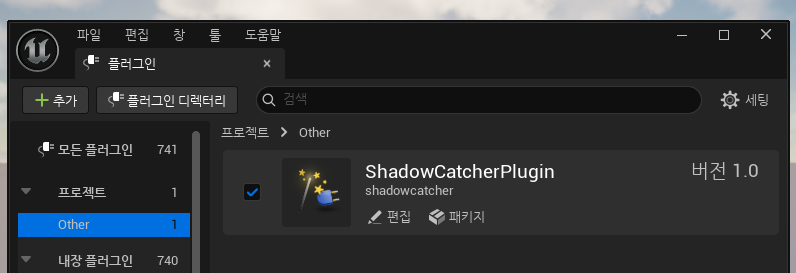
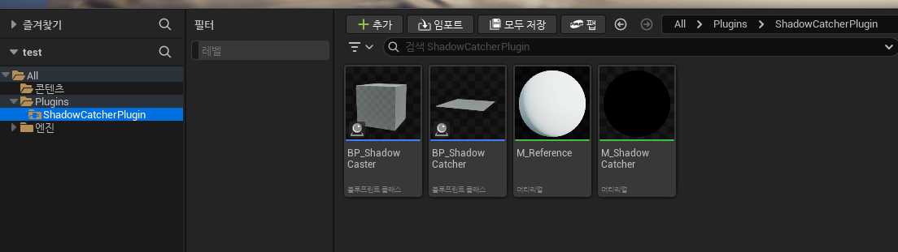
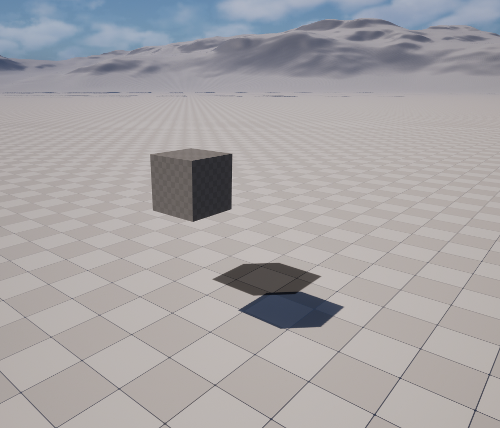
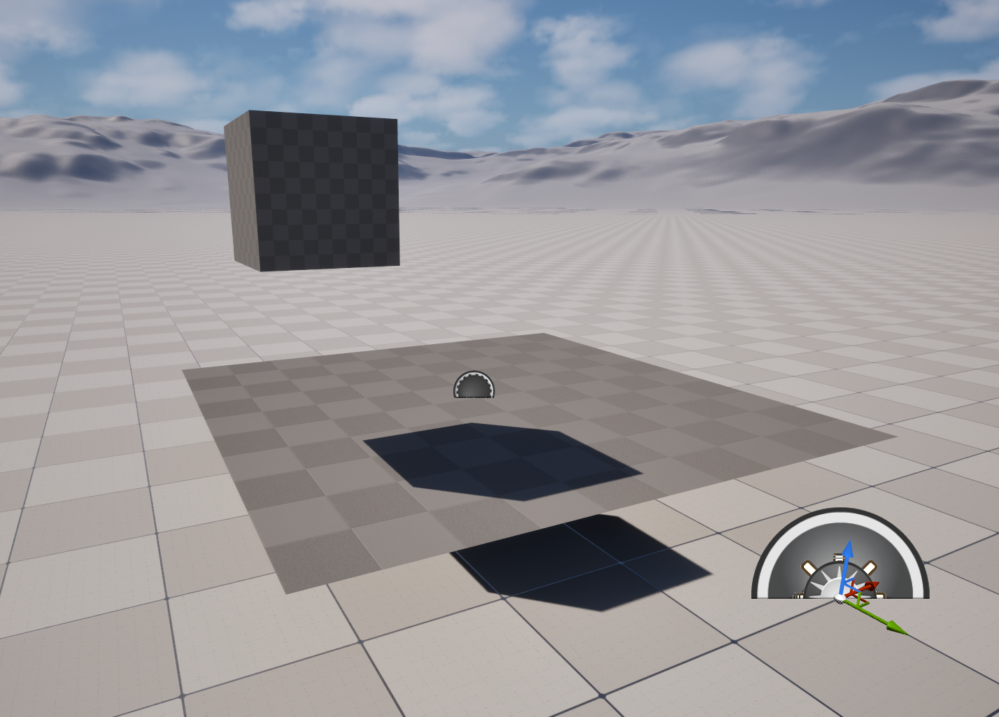
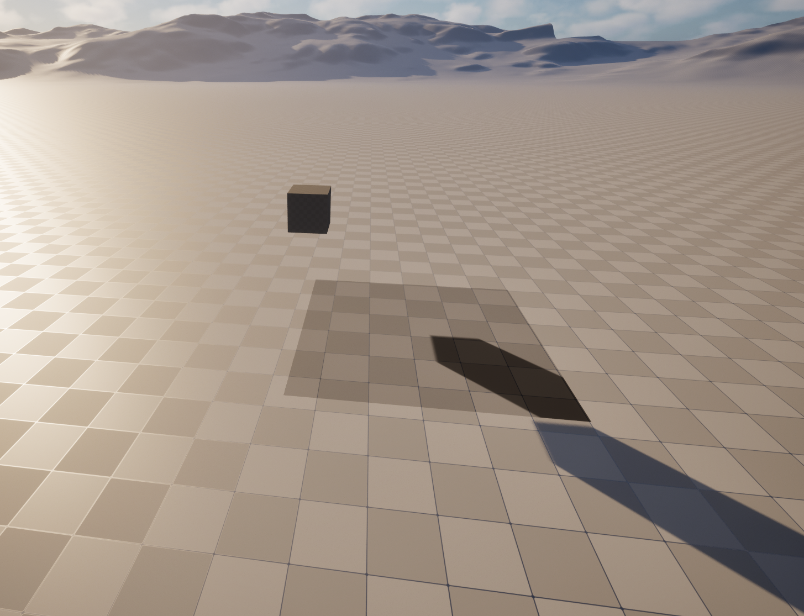

# Shadow Catcher Plugin — 사용 가이드

씬에 존재하는 오브젝트의 그림자만 투명한 평면 위에 실시간으로 렌더링하는 플러그인.

그림자가 없는 영역은 완전히 투명하게 처리되어 다른 배경과 자연스럽게 합성됩니다.

[**구현 과정 정리 문서 blueprint.md**](blueprint.md)

---

## 설치 방법

### 0. Release 다운로드

releases 페이지에서 최신 zip 파일 다운로드

[releases 페이지로 이동](https://github.com/insung52/ShadowCatcher_Unreal/releases)

### 1. Plugins 폴더에 복사

ShadowCatcherPlugin.ZIP 파일 압축 해제 후 프로젝트 루트 폴더의 `Plugins/` 안에 넣습니다.
`Plugins/` 폴더가 없으면 직접 생성하세요.

```
MyProject/
├── Content/
└── Plugins/
    └── ShadowCatcher/        ← 여기에
        ├── ShadowCatcher.uplugin
        └── Content/
```

### 2. 프로젝트 열기

UE5에서 프로젝트를 열면 플러그인 감지 팝업이 뜹니다.
**Yes** → 에디터 재시작.

팝업이 뜨지 않으면: **Edit → Plugins → "ShadowCatcher" 검색 → 체크박스 ON → 재시작**



### 3. Content Browser에서 확인

Content Browser 우측 하단 **Settings → Show Plugin Content** ON.
`ShadowCatcher Content` 폴더가 보이면 준비 완료.

---

## 씬에 배치하기

### Step 1. BP_ShadowCatcher 배치



`ShadowCatcher Content` 폴더에서 `BP_ShadowCatcher`를 Viewport로 드래그합니다.

배치 후 **Details 패널**에서 조절 가능한 항목:

| 항목 | 설명 | 기본값 |
|---|---|---|
| **Catcher Scale** | 그림자를 받을 평면의 크기 | 5.0 |
| **Capture Height** | 위에서 내려다보는 카메라 높이 | 600.0 |
| **Capture Resolution** | 캡처 해상도 (높을수록 선명, 성능 소모 증가) | 512 |

> Catcher Scale을 바꾸면 평면 크기와 캡처 범위가 자동으로 동기화됩니다.

### Step 2. BP_ShadowCaster 배치

그림자를 드리울 오브젝트를 `BP_ShadowCaster`로 대체하거나,
기존 메시를 BP_ShadowCaster의 ShadowMesh 슬롯에 넣습니다.

배치하는 순간 자동으로 BP_ShadowCatcher의 캡처 목록에 등록됩니다.

### Step 3. Play



**Play 버튼**을 누르면 자동으로 초기화됩니다.
별도 설정 없이 그림자가 평면 위에 표시됩니다.

---

## 에디터에서 그림자가 보이지 않는 이유



에디터에서는 평면이 기본 메터리얼로 보입니다. **이것은 정상 동작입니다.**

### 왜 그런가

이 플러그인은 에디터가 아닌 **런타임(Play)**에서 초기화됩니다.

```
에디터 상태:
  BP_ShadowCatcher 배치됨
  → 렌더 타겟(RT) 아직 없음
  → 머티리얼에 연결된 텍스처 없음
  → 평면이 투명하게 보임  ← 정상

Play 버튼 누름:
  → RT 자동 생성
  → 머티리얼에 RT 연결
  → SceneCapture 캡처 시작
  → 그림자 표시됨  ← 정상
```

### 왜 에디터에서 바로 작동하지 않게 설계했는가

에디터에서 보이지 않는 직접적인 이유는 **RT(렌더 타겟)와 머티리얼 인스턴스가 아직 생성되지 않았기 때문**입니다.
이 두 가지는 BeginPlay에서 생성되므로, Play 전 에디터 상태에서는 존재하지 않습니다.

RT와 머티리얼 인스턴스를 에디터 시점(Construction Script)에서 생성하지 않는 이유는 다음과 같습니다.

UE5 에디터에서 액터의 속성을 변경할 때마다 Construction Script가 재실행됩니다.
Shadow Catcher를 움직이거나 Catcher Scale, Capture Height 같은 값을 조절하면
그때마다 CS가 실행되고, CS에서 RT를 생성할 경우 새 RT가 계속 만들어집니다.
이전에 만들어진 RT는 GPU에서 즉시 해제되지 않고 쌓이기 때문에
슬라이더를 드래그하는 동안 GPU 메모리가 순식간에 고갈됩니다.

이를 해결하기 위해 RT/머티리얼 인스턴스 생성을 BeginPlay로 이동했습니다.
BeginPlay는 Play 시작 시 인스턴스당 1회만 실행되고, 종료 시 자동으로 리소스를 해제하므로 누적이 발생하지 않습니다.

---

## 여러 개 배치

BP_ShadowCatcher를 여러 개 배치해도 각자 독립적으로 작동합니다.

```
BP_ShadowCatcher_01  →  RT_A (자동 생성)  →  독립된 그림자 캡처
BP_ShadowCatcher_02  →  RT_B (자동 생성)  →  독립된 그림자 캡처
```

각 인스턴스가 Play 시 자신만의 렌더 타겟을 생성하기 때문에
서로 간섭하지 않습니다.

---

## 그림자 경계 품질 조절

그림자 경계의 반짝임이 보일 경우:

**Project Settings → Engine → Rendering → Shadows**
- `Shadow Map Method`: `Virtual Shadow Maps` → `Shadow Maps` 로 변경

Virtual Shadow Maps(VSM)는 UE5 기본값으로, 경계에 temporal 노이즈를 적용합니다.
전통적인 Shadow Maps로 전환하면 경계가 안정적으로 표시됩니다.

---

## 주의사항

- **Play 전에 설정할 것**: Catcher Scale, Capture Height, Capture Resolution은
  Play 중에 변경해도 즉시 반영되지 않습니다. Play 전 에디터에서 설정하세요.

- **Directional Light 필요**: 그림자가 생기려면 씬에 Light가 있어야 하며
  `Cast Shadows`가 켜져 있어야 합니다.

---

## 한계



### 현재 방식의 근본적인 문제

현재 구현은 SceneCapture로 찍은 Reference Plane의 밝기를 반전해 투명도로 사용합니다.

```
밝은 픽셀 (그림자 없음) → 1 - 밝기 → 0 → 투명
어두운 픽셀 (그림자)     → 1 - 밝기 → 1 → 불투명
```

이 방식은 **빛의 상태에 따라 결과가 달라집니다.**

- **빛이 평면에 수직이 아닐 때**: 그림자 없는 영역도 각도에 따라 밝기가 달라지므로
  일부 영역이 완전히 투명해지지 않고 희미하게 보입니다.
- **주변광(Ambient Light)이 강할 때**: 그림자 영역에도 빛이 어느 정도 들어오기 때문에
  그림자가 반투명하게 표시됩니다.
- **결론**: 복잡한 씬에서는 그림자 유무를 정확히 0/1로 판별하는 것이 불가능하며,
  항상 빛 조건에 따른 오차가 발생합니다.

---

### 개선 가능한 방향

현재 방식의 한계를 해결하는 접근은 크게 두 갈래입니다.

---

#### 갈래 1. 정규화 기반 — 현재 컬러 캡처 유지, 기준값을 보완

"그림자 없는 상태의 밝기"를 구해서 정규화 및 비교하면 빛 조건 변화를 보정할 수 있습니다.

```
shadow = (기준_밝기 - 현재_밝기) / 기준_밝기
→ 빛 각도/세기와 무관하게 0~1로 정규화됨
```

**기준 밝기를 구하는 방법:**

| 방법 | 원리 | 장점 | 단점 |
|---|---|---|---|
| **저해상도 NoShadow RT** | 그림자 캐스터를 제외해서 Reference Plane만 찍은 별도 RT. 해상도는 16x16 이하도 충분 (수평 평면은 단일 밝기 이므로) | 정확, 구현 단순 | 빛/평면 변경 시 재캡처 필요. 트리거 조건 관리 필요 |
| **N프레임 간격 업데이트** | 위 방법에 주기적 재캡처 추가 | 빛이 서서히 바뀌는 씬 대응 | 정확한 N값 튜닝 필요. tolerance 보정 병행 필요 |

---

#### 갈래 2. Depth 기반 — 빛 방향에서 Depth 캡처, 컬러 캡처 교체

SceneCapture를 Directional Light 방향에 맞춰 배치하고 색상 대신 Depth를 캡처합니다.

Shadow Catcher 머티리얼에서 각 픽셀의 월드 포지션을 빛 카메라 공간으로 변환 후

캡처된 Depth와 비교해 그림자 여부를 판별합니다.

```
빛 방향 SceneCapture → Depth RT (Shadow Caster만 ShowOnly)
머티리얼:
  픽셀 월드 포지션 → 빛 카메라 공간 변환 → UV + 깊이 계산
  캡처된 깊이 < 픽셀 깊이 → 가로막힌 것 있음 → 그림자
  캡처된 깊이 ≈ 픽셀 깊이 → 통과 → 투명
```

| 항목 | 내용 |
|---|---|
| SceneCapture 수 | 1개 (현재와 동일, 컬러 캡처를 Depth 캡처로 교체) |
| 빛 조건 독립성 | 완전 독립 (밝기와 무관) |
| 그림자 경계 | 하드 엣지 (PCF로 소프트닝 가능) |
| 평면 전체 그림자 | 정상 동작 |
| 구현 난이도 | 높음 |
| 핵심 구현 과제 | 빛 카메라 VP 행렬을 Blueprint에서 머티리얼로 전달, SceneCapture를 Directional Light에 동기화 |

---

#### 방향 요약

| | 갈래 1 (정규화) | 갈래 2 (Depth) |
|---|---|---|
| 현재 구조 변경 | 작음 (SceneCapture 1개 추가) | 큼 (캡처 방식 전면 교체) |
| 빛 조건 독립성 | 부분적 | 완전 |
| 소프트 섀도 유지 | 가능 | 별도 처리 필요 |
| 구현 복잡도 | 낮음~중간 | 높음 |
| 추천 씬 | 빛이 자주 바뀌지 않는 씬 | 빛 조건이 불안정하거나 정확도가 중요한 씬 |

