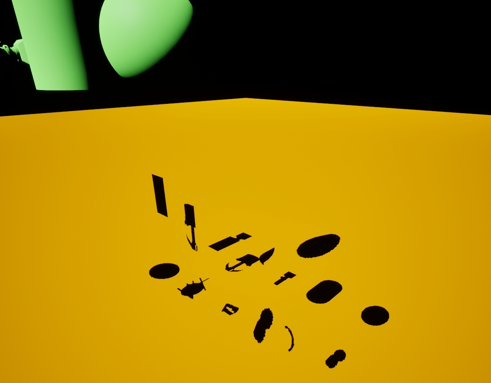
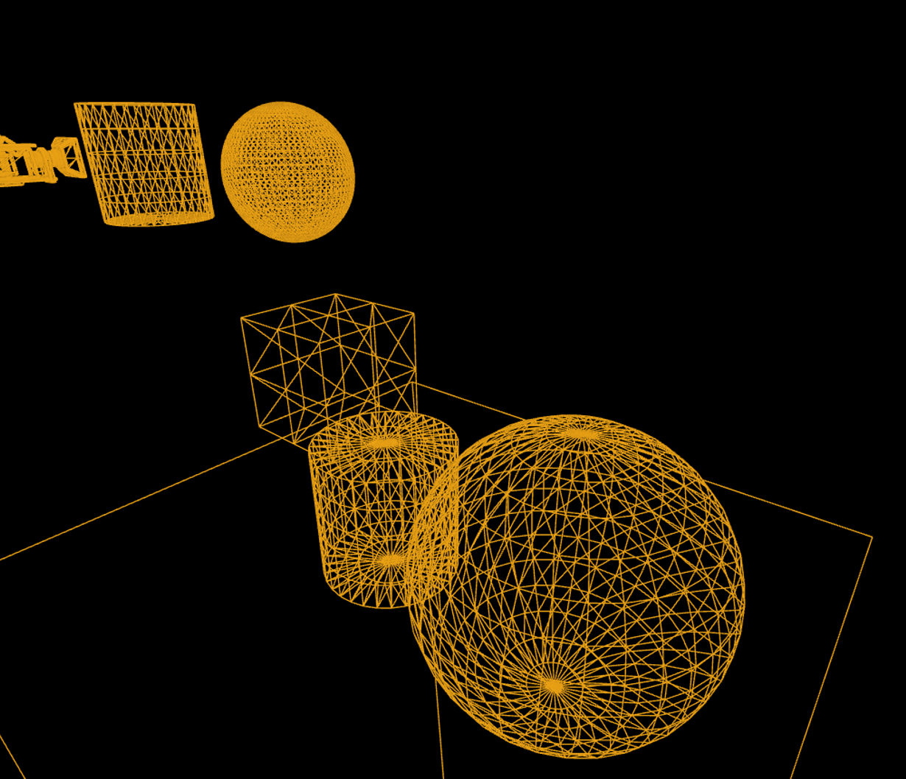
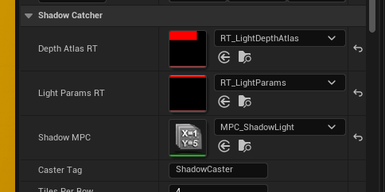
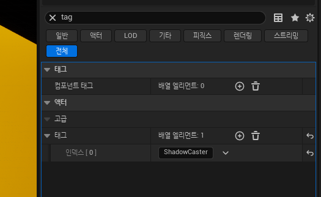
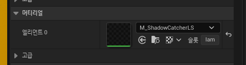

# ShadowCatcherLS

임의 형태의 메시 위에, **여러 디렉셔널 라이트**의 그림자를 받아 투명하게 합성하는 셰도우 캐처 플러그인 (UE 5.7).
빛 공간 깊이(light-space depth) 방식이라 catcher 메시의 모양·스케일·회전이 자유롭고, catcher를 여러 개 써도 됩니다.

---

## 1. 어떻게 작동하는가 (사용법)

### 설치
1. `Plugins/ShadowCatcherLS` 폴더를 대상 프로젝트의 `Plugins/`에 복사.
2. 코드 모듈이 포함된 플러그인이라 **C++ 컴파일이 가능한 프로젝트**여야 합니다(첫 실행 시 빌드 요청 → 수락). 또는 바이너리로 패키징해 배포.
3. 에디터에서 플러그인 활성화 확인.

### 씬 구성 (4단계)
1. **Manager 배치** — `ShadowDepthManager` 액터를 레벨에 **1개**(directional light 개수에 관계 없이) 배치하고 Details에서 지정:
   - `Depth Atlas RT` = `RT_LightDepthAtlas`
   - `Light Params RT` = `RT_LightParams`
   - `Shadow MPC` = `MPC_ShadowLight`
   (셋 다 플러그인 콘텐츠에 포함되어 있음)

2. **Caster 태그** — 그림자를 *던질* 액터의 **Actor Tag**에 `ShadowCaster` 추가.

3. **Catcher 머티리얼** — 그림자를 *받을* 아무 메시에 `M_ShadowCatcherLS` 적용. 모양/스케일/회전 자유, 여러 개 가능.

4. **디렉셔널 라이트** — 레벨에 1개 이상 두고 **Play**.

### 동작
- 커버 범위는 `ShadowCaster` 태그가 붙은 액터들의 **합산 바운드에 자동으로 맞춰집니다**(고정 크기 한계 없음).
- 여러 빛의 그림자는 기본적으로 **평균**으로 합쳐집니다(빛이 많을수록 한 그림자는 옅어짐 — 물리적으로 자연스러움).
- **빛을 향한 면**에만 그림자가 그려집니다.

### Manager 조정 값
| 값 | 의미 |
|---|---|
| `Tile Size` | 빛 1개당 그림자 해상도. 큰 씬에서 높은 값을 사용(ex. 2048). Atlas RT 크기는 자동 조정. |
| `Tiles Per Row` | Atlas 격자 수 조절. 빛 최대 개수 = `TilesPerRow²`. |
| `Bounds Padding` | caster 바운드 여백(그림자 잘림 방지). |
| `Depth Bias` | 그림자 줄무늬(acne) ↔ 떠 보임(peter-panning) 균형. |
| `Shadow Strength` | 그림자 불투명도(평균 모드). |
| `Round Robin` | 프레임당 빛 1개만 갱신(저비용, 약간의 지연) vs 매 프레임 전체. (프레임 당 빛 개수 만큼 캡쳐) |
| `Force Opaque Shadow` | 가려진 픽셀을 **무조건 불투명 검정**으로(평균·Strength 무시). |

 Atlas 는 (Tile Size) * (Tiles Per Row) 해상도로 자동 리사이즈 됩니다.

### 용량 / 한계
- 빛 개수 상한은 `TilesPerRow²` 와 파라미터 RT 높이(기본 256)까지 — 둘 다 설정으로 확장 가능, 셰이더에 고정된 한계는 없음.
- 빛마다 직교 깊이맵 1장(캐스케이드 없음). caster가 아주 넓게 흩어진 씬은 해상도가 분산되므로 `Tile Size`를 키우거나 구역별 Manager로 대응해야함.

---

## 2. 어떻게 구현했는가 (개요)

**방식: 빛 공간 깊이(섀도우 매핑).** 위에서 내려다본 투영을 catcher에 다시 입히는 이전 방식 대신, **빛 방향에서 본 caster 깊이**와 catcher 픽셀의 빛 공간 깊이를 비교해 가려짐을 판정합니다. 그래서 그림자가 빛에 종속되며, 깊이 정보 한 벌로 **모든 catcher**를 처리할 수 있습니다.

### Manager (`AShadowDepthManager`, C++)
- 매 프레임 각 디렉셔널 라이트마다: 직교 `SceneCapture2D`를 빛 방향으로 정렬 → `ShowOnly` caster의 깊이(`SceneDepth`)를 임시 RT에 캡처 → **RHI 복사로 공유 깊이 아틀라스의 해당 타일**에 기록 (`Round Robin`이면 프레임당 1개).
- 빛별 **방향**은 파라미터 RT(행 i = 빛 i)에 기록, 공통 값(caster 바운드·빛 개수·bias·strength 등)은 **MPC**에 기록.

### 머티리얼 (`M_ShadowCatcherLS`, Unlit/Translucent)
- 픽셀마다 `NumLights`만큼 반복: 파라미터 RT에서 빛 방향을 읽어 → 공유 바운드로 그 빛의 직교 프레임을 복원 → 픽셀을 빛 공간으로 투영(UV·깊이) → 해당 아틀라스 타일을 샘플 → 깊이 비교로 가려짐 판정.
- `N·L` 게이트로 빛을 등진 면 제외. 결과를 평균(또는 `Force Opaque`면 이진)으로 합쳐 **그림자를 불투명도로 출력**.

### 이 설계의 이유
- 그림자가 빛 기준이라 **깊이 한 벌이 모든 catcher를 커버** → catcher 수·메시 형태에 무관하게 확장.
- 빛 개수가 셰이더에 박혀 있지 않음(방향은 데이터 RT, 루프는 동적) → 용량을 설정으로 조정.

---

## 포함된 에셋
- `ShadowDepthManager` (C++ 액터)
- `M_ShadowCatcherLS` (catcher 머티리얼)
- `MPC_ShadowLight` (공통 파라미터 컬렉션)
- `RT_LightDepthAtlas` (공유 깊이 아틀라스)
- `RT_LightParams` (빛별 데이터)
